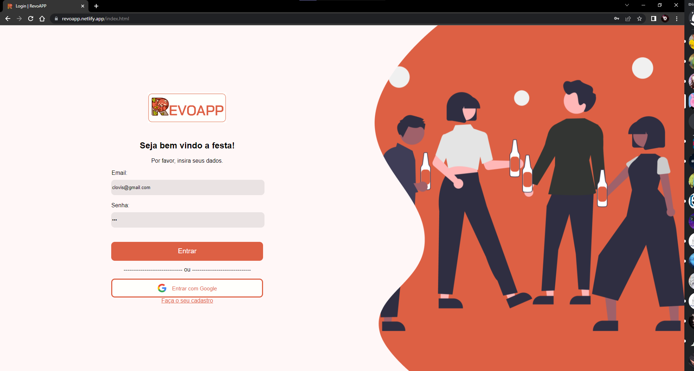
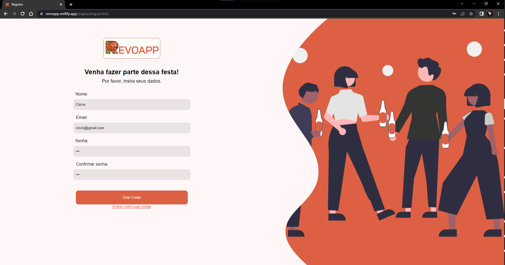
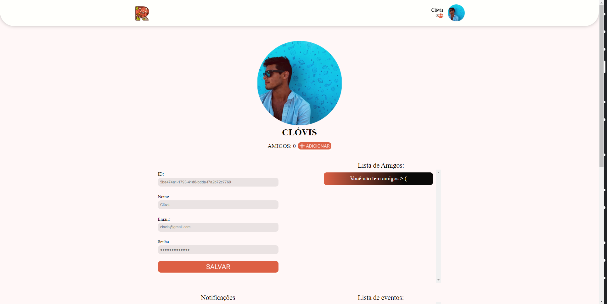
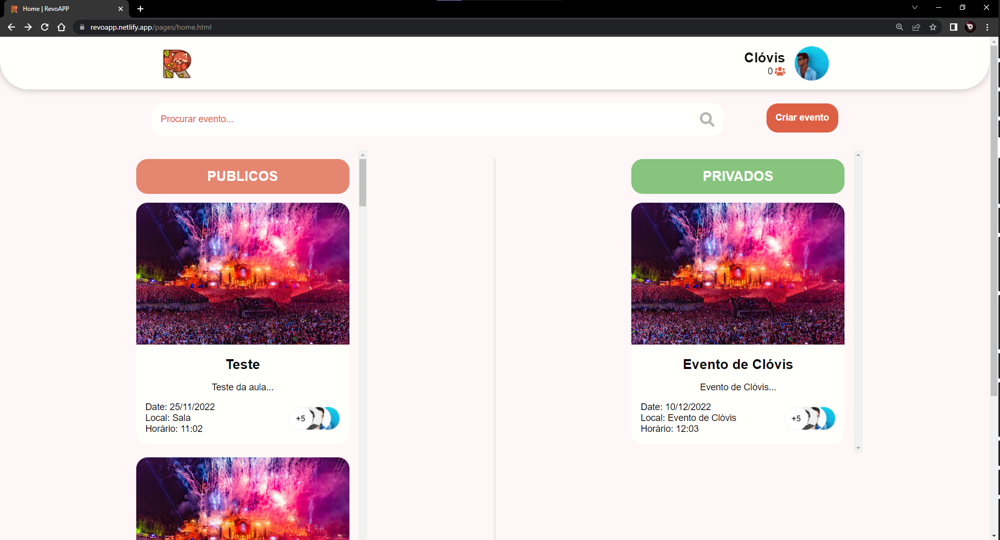
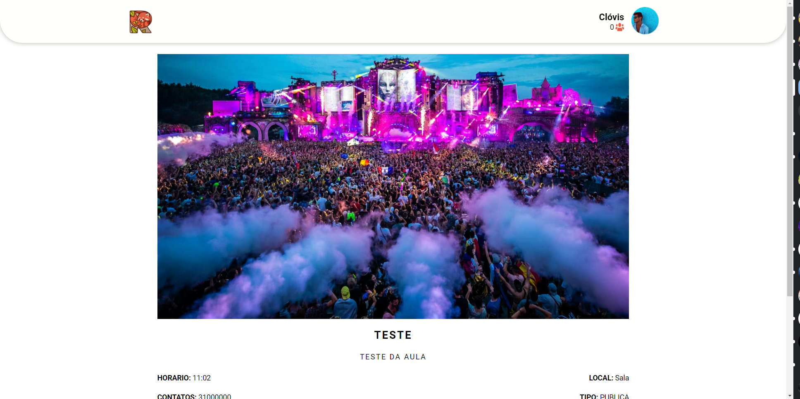
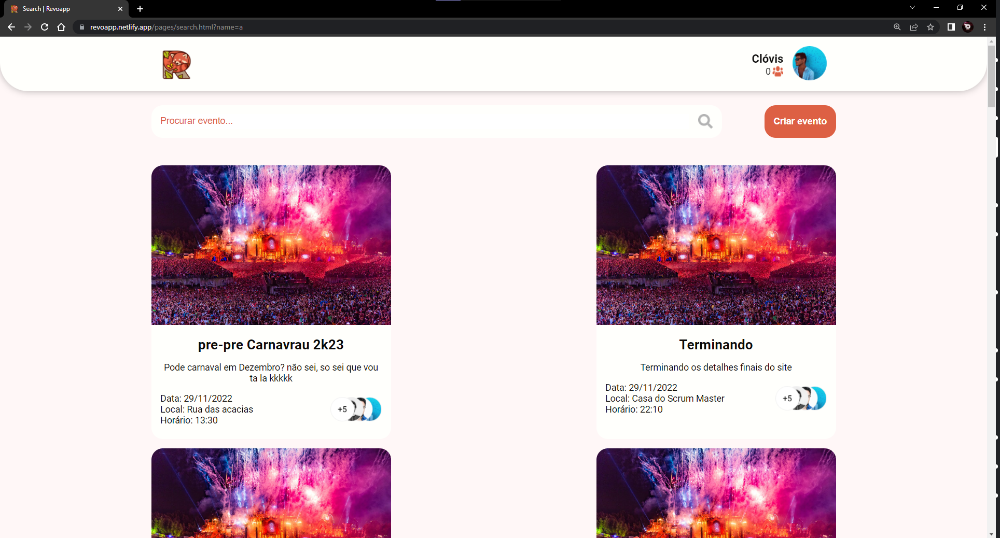
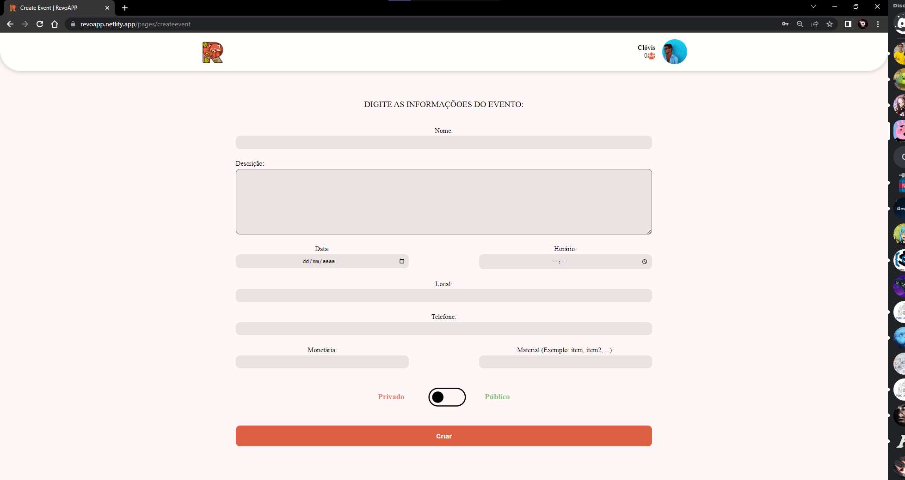

<div align=center>
    
</div>

<div align=center> 

[](https://app.netlify.com/sites/revoapp/deploys)
	


</div>

<p align=center>
    RevoAPP um applicativo que tem a missão de melhor e facilitar a conexão e interação as pessoas, a partir de uma plataforma aonde os usuários podem criar, participar e patrocinar eventos, criado por amigos ou não.
</p>


<p align="center">
 <a href="#camera-demonstração">Demostração</a> •
 <a href="#gear-responsabilidades">Responsabilidades</a> •
 <a href="#electric_plug-tecnologias">Tecnologias</a> •
 <a href="#computer-instalação">Instalação</a> •
 <a href="#raising_hand_man-autores">Autores</a> •
 <a href="https://github.com/SitaGomes/RevoAPP/blob/master/docs/relatorio_final.md">Documentação mais completa</a> 
</p>

## :camera: Demonstração

<div align=center>
	<a href="https://revoapp.netlify.app/" target="_blank">🚀 Acesse o site por aqui 🚀</a>
</div>


<div align=center>
    
    
    
    
    
    
    
</div>

## :gear: Responsabilidades
- [X] O usuário deve poder criar, patrocinar e participar de eventos;
- [X] A Aplicação não deve mostrar eventos privados para quem não foi convidado;
- [X] O patrocinio deve ser autorizado pelo dono do evento; 
- [X] Apenas o dono do evento privado deve ter a permissão para enviar convites;


## :electric_plug: Tecnologias
Frontend:
* [HTML](https://developer.mozilla.org/pt-BR/docs/Web/HTML)
* [CSS](https://developer.mozilla.org/pt-BR/docs/Web/CSS)
* [SCSS](https://sass-lang.com/)
* [Javascript](https://developer.mozilla.org/pt-BR/docs/Web/JavaScript)

Banckend:
* [TypeScript](https://www.typescriptlang.org/)
* [Express](https://expressjs.com/)
* [Prisma](https://www.prisma.io/)
* [Postegressql](https://www.postgresql.org/)

Devops:
* [Docker](https://www.docker.com/)
* [Railway](https://railway.app/)
* [Netlify](https://www.netlify.com/)

## :computer: Instalação
```bash
// Primeiro baixe o repositorio
$ git clone http://github.com/SitaGomes/RevoAPP

// Em seguida abra a pasta pelo terminal
$ cd RevoAPP

// Va para a pasta backend
$ cd backend

// Instale as dependencias
$ npm install

// Inicie o backend
$ npm run start

// Abra o arquivo src/index.html pelo live server

```

## :raising_hand_man: Autores

Created with ♥ by Sita Gomes, Guilherme Drumond, Arthur Miranda, Giovani Duarte, Luiz Gustavo, Henrique Peixoto, let's chat!


