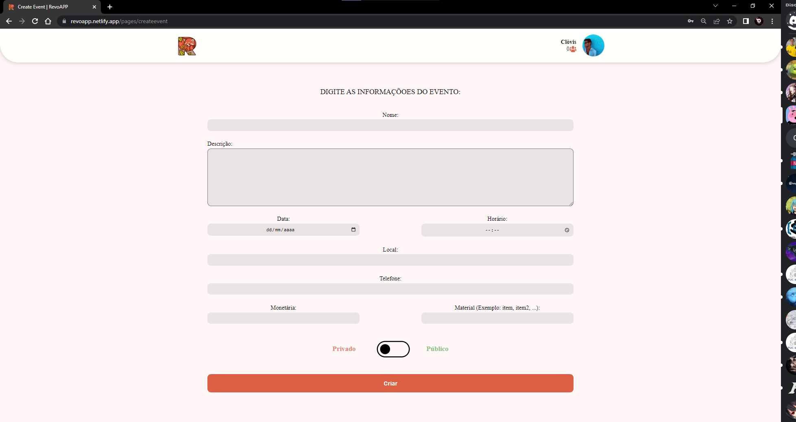
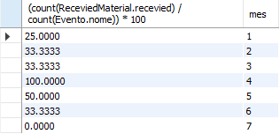
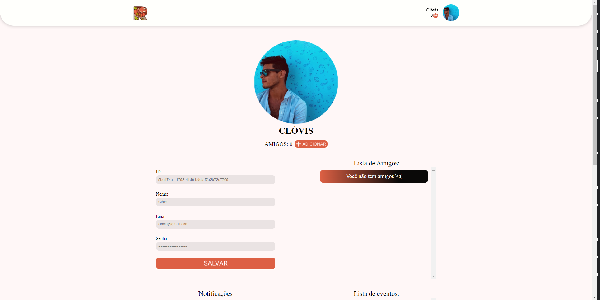
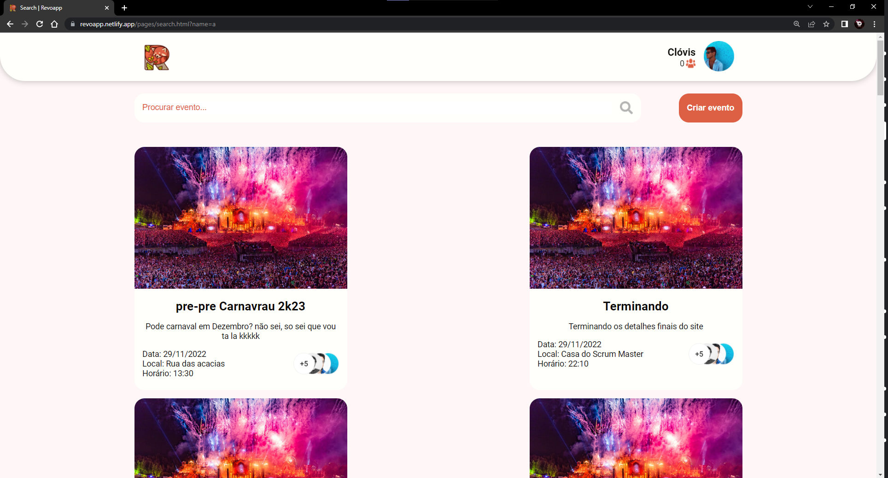

# RevoApp

* **Arthur do Nascimento Sita Gomes, arthur.gomes.1388895@sga.pucminas.br**

* **Arthur Miranda Sales, amsales@sga.pucminas.br**

* **Luiz Gustavo Mendes Santos, luizmendes@sga.pucminas.br**

* **Giovanni Bogliolo Sirihal Duarte, gbsduarte@sga.pucminas.br**

* **Guilherme Drumond Silva, guilherme.drumond@sga.pucminas.br**
 
* **Henrique Póvoa Peixoto,  henrique.peixoto1391540@sgapucminas.br**

---

Professores:

* **Cleiton Silva Tavares**
* **Felipe Augusto Lima Reis**
* **Hugo Bastos de Paula**

---

_Curso de Engenharia de Software, Unidade Praça da Liberdade_

_Instituto de Informática e Ciências Exatas – Pontifícia Universidade de Minas Gerais (PUC MINAS), Belo Horizonte – MG – Brasil_

---

_**Resumo**. Escrever aqui o resumo. O resumo deve contextualizar rapidamente o trabalho, descrever seu objetivo e, ao final, 
mostrar algum resultado relevante do trabalho (até 10 linhas)._

---

## 1. Introdução

Este projeto tem como finalidade principal apresentar a aplicação “RevoAPP”, um sistema que está sendo desenvolvido por nossa equipe para atender a disciplina Trabalho Interdisciplinar Aplicação de Processos e Negócios. O projeto propõe desenvolver uma plataforma web com o foco em criar, procurar e patrocinar eventos. Dessa forma, com a dificuldade de organizar eventos, este trabalho busca fornecer um ambiente interativo, acessível e fácil de se utilizar para que as pessoas possam se encontrar.

A aplicação propõe solucionar a desorganização de eventos, propondo um ambiente centralizado que mostra várias opções para o usuário organizar seus próprios eventos. Além disso, também a possibilidade de pesquisar por eventos, sendo eles públicos ou privados.

    1.1 Contextualização

   Está documentação tem como objetivo principal apresentar o projeto “RevoAPP”, uma plataforma digital na área de criação e procura de eventos. No Brasil, durante a pandemia várias pessoas foram obrigadas a permanecer em casa e ficar sem sair com seus amigos. Com isso, vários eventos, shows e festas foram canceladas ou adiadas. Segundo o presidente da Associação Brasileira dos Promotores de Eventos (Abrape), mais de 350 mil eventos não foram realizados em 2020, o que consequentemente, gerou um prejuízo de R$ 90 bilhões neste setor. Esses dados revelam que a pandemia gerou uma defasagem no mercado de eventos, o que evidencia a necessidade de suprir o mercado.

    1.2 Problema

   O principal problema encontrado nessa área é a falta de organização na hora de se criar um evento. Muitos indivíduos procuram participar ou criar eventos, porém a falta de planejamento e a falta de uma ferramenta intuitiva torna difícil para indivíduos que não possuem experiência consigam achar ou criar seus próprios eventos. Isso faz com que diversos eventos sejam muitas vezes cancelados ou esquecidos, custando muitas vezes dinheiro dos organizadores e patrocinadores do evento. Além disso com a diminuição no número de casos de COVID, cada vez mais pessoas procuram sair de casa , porém após o longo período de confinamento acabam sem saber onde estão acontecendo os eventos próximos a elas.

    1.3 Objetivo geral

   Nosso projeto tem como principal objetivo reunir pessoas e auxiliar a criação e exibição de eventos a partir da nossa plataforma, juntar pessoas conhecidas em eventos de pequeno e médio porte, possuindo suporte para eventos grandes porém somente para a exibição deles. Além disso, auxiliar no patrocínio ou fornecimento de recursos para a realização de eventos, o que contribui para o encontro de pessoas.

    1.3.1 Objetivos específicos

1 - Ajudar pessoas a encontrar eventos para ir com seus amigos, fornecendo uma grande gama de opções publicas e privadas.
     
2 - Auxiliar organizadores de eventos a encontrar mais pessoas para ir aos seus eventos, atravez da nossa abundante base de usuários.
 
3 - Apoiar organizadores de eventos a conseguir patrocinadores para seus eventos, podendo contribuir com dinheiro ou alimentos escolhidos pelo organizador.

    1.4 Justificativas

Há uma grande quantidade de pessoas que gostariam de sair de casa e se divertir, porém, há também uma grande dificuldade para donos de eventos organiza-los e convidar participantes, pela falta de ferramentas de auxílio para tal.  Por este motivo, esse projeto busca facilitar a organização de qualquer tipo de eventos, para os donos e participantes, assim aumentando as oportunidades para reencontrar ou fazer amizades e socializar.

## 2. Participantes do processo

   Os principais participantes do processo são, os organizadores de eventos de pequeno a médio porte, indivíduos que procuram eventos e pessoas que buscam participar e patrocinar eventos. Os organizadores de eventos buscam promover seus eventos sejam eles privados ou públicos no site. Já os usuários buscam através da ferramenta, entrar em eventos sejam por convites ou por pesquisa. Por fim, os fornecedores/patrocinadores buscam financiar os eventos, tanto de forma monetária quanto material.
 
   O site contará com todos os perfis de indivíduos já que os estilos de eventos vão desde festas de crianças até casamentos de pessoas mais velhas, possibilitando  assim uma variedade na idade e gênero dos usuários.
## 3. Modelagem do processo de negócio

## 3.1. Análise da situação atual

Diante deste cenário pós COVID existem diversas pessoas que não conseguem mais participar ou organizar eventos, pela insegurança, e desabituação que foi causada por essa situação. 
Com isso foi feita uma pesquisa de sites e aplicativos já existentes para solucionar este problema. Porém, as plataformas encontradas apenas demonstram o local e horário que aconteceram os eventos de grande porte e também não conseguem cobrir a maioria dos eventos que são organizados, com isso em mente foi desenvolvida a plataforma RevoApp, que mostra eventos de pequeno a médio porte, e também ajuda na organização, patrocínio, e procura dos mesmos.

## 3.2. Descrição Geral da proposta

Esse projeto traz como objetivo criar uma conexão entre o organizador de eventos, as pessoas interessadas e os patrocinadores, com fim de tornar o acesso a festas e encontros mais fáceis e práticos. Uma estratégia formulada é a recomendação de eventos com base na quantidade de amigos interessados em um evento específico. Um fator limitante é de os eventos de grande porte já possuírem uma gama de pessoas interessadas e de sites concorrentes já existentes no mercado que trazem o evento como opção .Como alternativa de melhoria é planejado criar uma forma de acesso a eventos maiores e de larga escala, como o link para a compra diretamente do site do evento.

## 3.3. Modelagem dos Processos

### 3.3.1 Processo 1 – Criação de evento

O primeiro processo é a criação de eventos, na qual o usuário clica na opção de criar eventos. Após isso, ele digita as informações a respeito do evento, como nome, local, data e horário. Em seguida o usuário escolhe o tipo do evento, podendo ser privado ou público. Se o usuário escolher o tipo público, o sistema irá publicar o evento. Caso seja escolhido o tipo privado, o usuário deverá convidar seus amigos.

### 3.3.2 Processo 2 – Convidar amigo

   Apos criar um evento privado, o usuário tem a opção de convidar um amigo. Primeiro o sistema mostra a lista de amigos que o usuário já possui, em seguida o usuário pode procurar por um amigo existente ou procurar por um novo usuário. Logo apos é feito um convite para o evento, aonde o usuário convidado pode recusar ou aceitar. Aceitando o convite o usuário é automaticamente adicionado ao evento, recusando é enviada uma notiicação ao criador do evento.

### 3.3.3 Processo 3 – Pesquisar evento

   O terceiro processo é o de pesquisar eventos, no qual o usuário poderá escolher entre a aba de eventos privados, feed de eventos e pesquisar pelo nome. Caso opte pela aba de eventos privados, todos os eventos privados que ele foi convidado irão aparecer. Com isso, ele acessa as informações do evento desejado e confirma ou não a presença no evento. Ele pode também pesquisar o evento, o mesmo acessa a barra de pesquisa e digita o nome do evento correspondente. Após isso, o usuário acessa as  informações do evento e confirma ou não a presença. Em último caso  o usuário escolha pelo feed de eventos, ele seleciona os filtros e tags de eventos desejados. Após isso, o usuário acessa as informações do evento e confirma ou não a presença.

### 3.3.4 Processo 4 - Patrocinar evento

O quarto processo é o de patrocinar eventos, no qual o usuário irá Buscar o evento, selecionar o qual que deseja patrocinar, então ele deve escolher como quer patrocinar, monetáriamente, com materiais ou ambos, se ele escolher patrocinar monetariámente irá aparecer a meta de doação do dono do evento, se o patrocinador escolher patrocinar com materiais irá aparecer quais materiais que foram requisitados pelo dono do evento se ele escolher patrocinar das duas formas ambas a meta de doação e os produtos requisitados aparecerão, após essa escolha o fornecedor irá clicar no botão "Patrocinar", assim confirmando que ele tem interesse de patrocinar o evento, e entao ele irá receber o contato do dono do evento para entrar em contato. O dono do evento será notificado com a proposta de patrocinio, e então ele pode escolher aceitar ou recusar a oferta, se o dono aceitar a oferta ele deve resolver os detalhes do patrocinio com o patrocinador assim terminando o processo, e se ele recusar o processo sera finalizado.

### 3.3.5 Processo 5 - Adicionar amigo

O quinto processo é o de adicionar amigo, onde o usuário vai entrar no mecanismo de busca de usuários, procurar o nome da pessoa que ele deseja adicionar na sua lista de amigos e clicar em adicionar, fazendo o envio de um pedido de amizade para o usuário onde ele pode escolher se aceita a solicitação ou recusa. Caso seja você o usuário que esteja recebendo uma solicitação de amizade, aparecerá um pop-up que ira mostrar as solicitações pendentes para aceitar ou recusar. 

### 3.3.6 Processo 6 - Login / Cadastro

O sexto processo é onde o usuario vai realizar o login e se caso necessario realizar o cadastro com suas informações como nome, idade, email e senha. Caso ja castrado o usuário vai preencher os campos de email e senha para poder logar no site, caso a senha ou o email esteja incorreto o usuário recebera uma mensagem informando.

## 4. Projeto da Solução

### 4.1. Detalhamento das atividades

Descrever aqui cada uma das propriedades das atividades de cada um dos processos. Devem estar relacionadas com o modelo de processo apresentado anteriormente.

#### Processo 1 – Criação de eventos

**Digitar informações do evento**

| **Campo** | **Tipo** | **Restrições** | **Valor default** |
| --- | --- | --- | --- |
| Título evento | Caixa de texto | Máximo 100 caracteres | --- |
| Data | Data | Formato de data (DD/MM/YY) | --- |
| Local | Caixa de texto | não pode ser NULL | --- |
| Horário | Caixa de texto | Somente caracteres numéricos| --- |
| Tags| Múltipla escolha | Mínimo uma seleção | --- |
| Meta | Caixa de texto | Caracteres não alfanuméricos | --- |
| Contato | Número | Somente caracteres numéricos | --- |
| Descrição | Caixa de texto | - | --- |

**Escolher tipo de evento**

| **Campo** | **Tipo** | **Restrições** | **Valor default** |
| --- | --- | --- | --- |
| Tipo do evento | Seleção única | Mínimo uma seleção | --- |

#### Processo 2 – Convidar amigo

**Procurar usuário**

| **Campo** | **Tipo** | **Restrições** | **Valor default** |
| --- | --- | --- | --- |
| Nome do usuário | Caixa de Texto | Not Null |  |
| Id do usuário | Caixa de Texto | Apenas 4 caracteres |   |

**Procurar amigo**

| **Campo** | **Tipo** | **Restrições** | **Valor default** |
| --- | --- | --- | --- |
| Nome do amigo | Caixa de Texto | Not Null | |
| Id do amigo | Caixa de Texto | Apenas 4 caracteres | |

#### Processo 3 – Pesquisar evento

**Acessar aba de eventos**

| **Campo** | **Tipo** | **Restrições** | **Valor default** |
| --- | --- | --- | --- |
| Eventos publicos |  Link |  | Eventos recomendados | 
| Eventos privado |  Link |  | Eventos recomendados |
| Eventos recomendados |  Link |  | Eventos recomendados |

**Pesquisar evento por nome**

| **Campo** | **Tipo** | **Restrições** | **Valor default** |
| --- | --- | --- | --- |
|  Nome do evento  |  Caixa de texto  |   Maximo de 50 carcteres  |  |

**Selecionar tags**
| **Campo** | **Tipo** | **Restrições** | **Valor default** |
| --- | --- | --- | --- |
|  Tags |  Seleção multipla  |  |  |

**Selecionar evento**

| **Campo** | **Tipo** | **Restrições** | **Valor default** |
| --- | --- | --- | --- |
|  Eventos apresentados  | Seleção unica  |  Evento deve existir |  |

**Confimar presença**

| **Campo** | **Tipo** | **Restrições** | **Valor default** |
| --- | --- | --- | --- |
|  Confirmar presença  | Seleção unica  | Evento deve existir  |  |
|  Recusar prensença  | Seleção unica  |  Evento deve existir   |  |

#### Processo 4 – Patrocinar evento

**Buscar Evento**
Ver o processo 3 (Pesquisar evento)

**Selecionar Evento**

| **Campo** | **Tipo** | **Restrições** | **Valor default** |
| --- | --- | --- | --- |
| Seleciona o evento | Seleção Única | Apenas um evento pr vez |  |
| Seleciona a opção de tipo de patrocinio | Múltipla escolha |  |  |
| Clica em "partocinar" | Seleção Única |  | Recebe contato do dono do evento |

#### Processo 5 - Adicionar amigo

**Procurar nome de usuário**

| **Campo** | **Tipo** | **Restrições** | **Valor default** |
| --- | --- | --- | --- |
| Nome do usuário | Caixa de Texto | não pode ser null |  |
| Id do usuário | Caixa de Texto | mínimo de 5 caracteres |   

#### Processo 6 – Login / Cadastro

**Fazer login**

| **Campo** | **Tipo** | **Restrições** | **Valor default** |
| --- | --- | --- | --- |
| Nome do usuário | Caixa de Texto | não pode ser null |  |
| Senha do usuário | Caixa de Texto | mínimo de 6 caracteres |   

**Registrar Cadastro**

| **Campo** | **Tipo** | **Restrições** | **Valor default** |
| --- | --- | --- | --- |
| Nome do usuário | Caixa de Texto | não pode ser null |  |
| Senha do usuário | Caixa de Texto | mínimo de 6 caracteres |
| Email do usuário | Caixa de Texto | não pode ser null |  |

### 4.2. Tecnologias

| **Frontend** | **Backend** 
| --- | --- 
| ReactJs | Express 
| Javascript | Prisma
| Sass | Typescript
| HTML5 | Docker
| JSON server | Postegressql
| Netlify | Heroku
| CSS3 | ...

## 5. Modelo de dados

Apresente o modelo de dados por meio de um modelo relacional ou Diagrama de Entidade-Relacionamento (DER) que contemple todos conceitos e atributos apresentados item anterior. 

## 6. Indicadores de desempenho

Apresente aqui os principais indicadores de desempenho e algumas metas para o processo. Atenção: as informações necessárias para gerar os indicadores devem estar contempladas no diagrama de classe. Colocar no mínimo 5 indicadores.

| **Indicador** | **Objetivos** | **Descrição** | **Cálculo** | **Fonte dados** | **Perspectiva** |
| --- | --- | --- | --- | --- | --- |
| Número de usuários por evento | Melhorar o algoritmo de recomendação de eventos | Taxa de usuários que interagem com os eventos do aplicativo | Somar o numero de usuários e dividir com o numero de usuários participando dos eventos | Tabela de eventos no Banco de dados | Aprendizado e crescimento
| Taxa de itens de patrocionio por evento| Melhorar o algoritimos de cadastro de material de patrocínio | Media de patrocínio com material nos eventos |   | Banco de Dados | Aprendizado e crescimento |
| Taxa logins feitos | Avaliar quanto os usuarios estão usando a plataforma | mensalmente seriam recolhidos a quantidade logins feitos no site, seria feita uma comparação em relação quantidade total de usuarios e a quantidade que loga mensalmente, mostrando a porcentagem de doaçoes que geralmente são feitas  | ∑totalUsuários/totalLogados  | Banco de dados | Usuário | 
| Criar evento | Avaliar quantitativamente o crescimento da criação de eventos | A quantidade de eventos criados ao longo do tempo |   | Testes de criação | Usuário |
| Quantia de patrocinio monetário | Descobrir a quantidade de dinheiro doado por mês | A quantidade de patrocínios monetarios recebido no mês |   | Testes de criação | Aprendizado e crescimento | 

Obs.: todas as informações para gerar os indicadores devem estar no diagrama de classe **a ser proposto**

## 6.1. Indicadores implementados

### 6.1.1 Número de usuários por evento
Esse indicador foi feito para que seja possível ver a taxa de usuarios que interagem com o appliicativo RevoApp mensalmente.

### 6.1.2 Taxa de patrocinio de material por mês
Esse indicador foi feito para que seja possível ver a taxa de materiáis patrocinados, nos eventos mensalmente.

### 6.1.3 Taxa logins feitos
Esse indicador foi feito para que seja possível ver a taxa de logins no site RevoApp mensalmente.

### 6.1.4 Criar evento
Esse indicador foi feito para que seja possível ver a quantidade de eventos que foram criados no site mensalmente e anualmente

### 6.1.5 Quantidade de patrocinio monetário
Esse indicador foi feito para que seja possível ver a quantia de patrocinio em dinheiro que foi doado, nos eventos mensalmente.

## 7.Sistema desenvolvido
Faça aqui uma breve descrição do software e coloque as principais telas com uma explicação de como usar cada uma.

### 7.1 Cadastro
Nessa Página o usuario irá criar uma nova conta para utilizar o RevoApp, ou clicar em "entre com sua conta" para ir para a pagina de Login.

### 7.2 Login
Nessa Página o usuario Logar com sua conta para utilizar o RevoApp, ou clicar em "Faça seu cadastro" para ir para a pagina de Cadastro.

### 7.3 Perfil
Tela de perfil do usuário, na qual é possível visualizar as informações do usuário, lista de amigos, notificações, lista de eventos que o usuário criou e lista de eventos que o usuário esta participando.

### 7.4 Adicionar Amigo
Tela presente na tela de perfil do usuário, na qual é possível adicionar um amigo buscando pelo nome do usuário.

### 7.5 Home
Tela principal, na qual é possível visualizar e acessar os eventos públicos e privados existentes.

### 7.6 Informações Evento
Tela de informações do evento, na qual é possível visualizar os detalhes e informações a respeito do evento acessado.

### 7.7 Criar Evento
Tela de criação de evento, na qual é possível o usuário criar seu próprio evento digitando as informações a respeito do mesmo.

### 7.8 Patrocinar
Tela de patrocínio, na qual é possível patrocinar um evento com materias ou monetário.

### 7.9 Convidar Amigos
Tela de convidar amigos, na qual é possível o usuário convidar um amigo para um evento digitando o nome.

### 7.10 Pesquisar Evento
Tela de pesquisar evento, na qual é possível buscar um evento presente no site digitando o nome dele na barra de pesquisa.

## 8. Conclusão

Apresente aqui a conclusão do seu trabalho. Discussão dos resultados obtidos no trabalho, onde se verifica as observações pessoais de cada aluno. Poderá também apresentar sugestões de novas linhas de estudo.

# Conclusão Guilherme Drumond:

A conclusão do trabalho foi que conseguimos entregar uma aplicação que cumpriu com os requisitos propostos inicialmente. Além disso, conseguimos entregar todos os processos de forma funcional, sendo eles, criar evento, pesquisar evento, patrocinar evento, login/cadastro, adicionar amigo e convidar amigo. Neste trabalho consegui evoluir bastante principalmente no frontend, o qual contribui para o desenvolvimento de grande parte dos processos. Uma nova linha de estudo é adicionar futuramente funcionalidades de chat, na qual é possível os usuários de um evento se comunicarem e mandarem avisos a respeito do evento.

# Conclusão Luiz Gustavo:

Apesar de todos os contra-tempos envolvendo principalmente a falta de conhecimento em algumas áreas o trabalho entrege no final conseguiu atender e superar todas as expectativas iniciais, ao longo do semestre os processos passaram por refinamentos e remodelagens a fim de criar o site mais eficiente e com maior qualidade possivel. Processos esses que fizeram com que todos os membros do grupo fosse atras de aprender novas tecnicas e habilidades, e pessoalmente minha experiencia no desenvilvimento do site mostrou todos os pontos que ainda possuo alguma dificuldade quando se trata de desenvolvimento front e back end.

# Conclusão Henrique Peixoto:

A conclusão sobre o trabalho foi que o objetivo inicial proposto foi concluído e conseguimos entregar uma versão que cumpre com todos requisitos e com todos processos funcionais. Ainda serão necessários estudos para futuras melhorias e atualizações com novas funcionalidades, mas no geral foi um ótimo trabalho e serviu como enorme fonte de aprendizagem para todos envolvidos.

# Conclusão Giovanni Duarte:

Acredito que esse trabalho ajudou muito para o aprendizado de cada um dos participantes, com certeza eu aprendi diversas coisas. Acredito que eu dei meu melhor, e mesmo assim posso aprender muito mais, estarei muito ansioso para fazer um trabalho assim novamente, e da proxima vez ajudar muito mais, com o conhecimento que terei futuramente. Sinceramente acho que algumas partes do grupo trabalharam muito mais intensamente que eu, e gostaria de ter essa oportunidade de trabalhar come eles novamente para mostrar que eu posso fazer ainda melhor.

# Conclusão Arthur Sita Gomes:

Sobre este trabalho, tenho a dizer que foi bastante desafiador, nas primeiras sprints criamos e desenvolvemos bem detalhadamente o nosso modelo de negocio e o banco de dados, para cumprir as demandas das sprints que eram diversas. Já nas ultimas sprints que eram de real desenvolvimento, encontramos alguns contratempos, pela escassez de assistência no decorer do desenvolvimento e upload do Backend e Frontend. Todavia, conseguimos concluir o trabalho com todos os processos funcionais em nivel de produção e outros requisitos previamente propostos pelas sprints.

# Conclusão Arthur Miranda Sales 

Sobre o trabalho, o objetivo principal foi concluido porem bastante desafiador, durante as sprints nosso grupo focou bastante em desenvolver uma modelagem precisa desde o inicio o que nos garantiu que ficassemos adiantados facilitando no processo de desenvolvimento do nosso figma. Porem nas ultimas sprints tivemos algumas dificuldades em relações a bugs muito por causa da falta de suporte. Entretanto felizmente conseguimos concluir o trabalho entregando-o com todos processos funcionais e cumprindo aos requisitos propostos pelas sprints.      

# REFERÊNCIAS

Como um projeto de software não requer revisão bibliográfica, a inclusão das referências não é obrigatória. No entanto, caso você deseje incluir referências relacionadas às tecnologias, padrões, ou metodologias que serão usadas no seu trabalho, relacione-as de acordo com a ABNT.

Verifique no link abaixo como devem ser as referências no padrão ABNT:

http://www.pucminas.br/imagedb/documento/DOC\_DSC\_NOME\_ARQUI20160217102425.pdf

**[1.1]** - _ELMASRI, Ramez; NAVATHE, Sham. **Sistemas de banco de dados**. 7. ed. São Paulo: Pearson, c2019. E-book. ISBN 9788543025001._

**[1.2]** - _COPPIN, Ben. **Inteligência artificial**. Rio de Janeiro, RJ: LTC, c2010. E-book. ISBN 978-85-216-2936-8._

**[1.3]** - _CORMEN, Thomas H. et al. **Algoritmos: teoria e prática**. Rio de Janeiro, RJ: Elsevier, Campus, c2012. xvi, 926 p. ISBN 9788535236996._

**[1.4]** - _SUTHERLAND, Jeffrey Victor. **Scrum: a arte de fazer o dobro do trabalho na metade do tempo**. 2. ed. rev. São Paulo, SP: Leya, 2016. 236, [4] p. ISBN 9788544104514._

**[1.5]** - _RUSSELL, Stuart J.; NORVIG, Peter. **Inteligência artificial**. Rio de Janeiro: Elsevier, c2013. xxi, 988 p. ISBN 9788535237016._

# APÊNDICES

**Colocar link:**

Do código (armazenado no repositório):
https://github.com/ICEI-PUC-Minas-PPLES-TI/plf-es-2022-2-ti2-0924100-revoapp/tree/master/src

Dos artefatos (armazenado do repositório);
https://github.com/ICEI-PUC-Minas-PPLES-TI/plf-es-2022-2-ti2-0924100-revoapp/tree/master/assets

Da apresentação final (armazenado no repositório):
https://revoapp.netlify.app/

Do vídeo de apresentação (armazenado no repositório):
https://github.com/ICEI-PUC-Minas-PPLES-TI/plf-es-2022-2-ti2-0924100-revoapp/blob/master/docs/Video%20apresenta%C3%A7%C3%A3o%20RevoApp.mp4
Link do vídeo no YouTube: https://youtu.be/7uxphu8Ss4w

